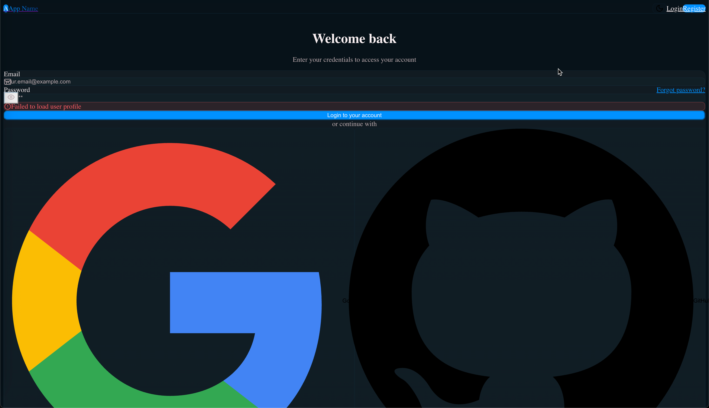
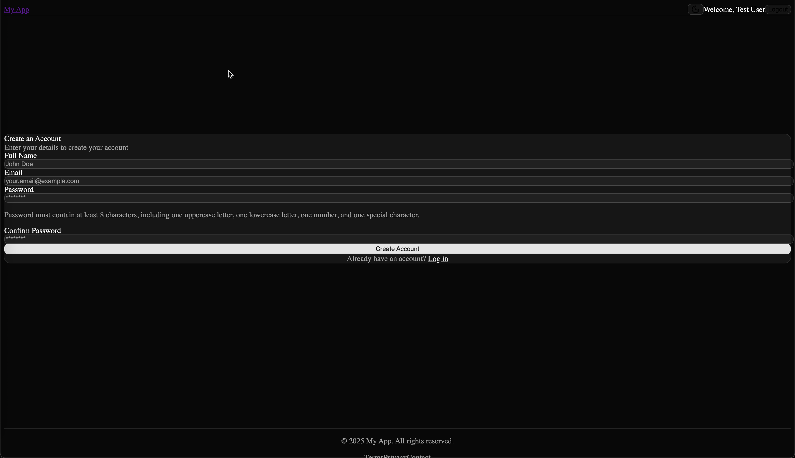
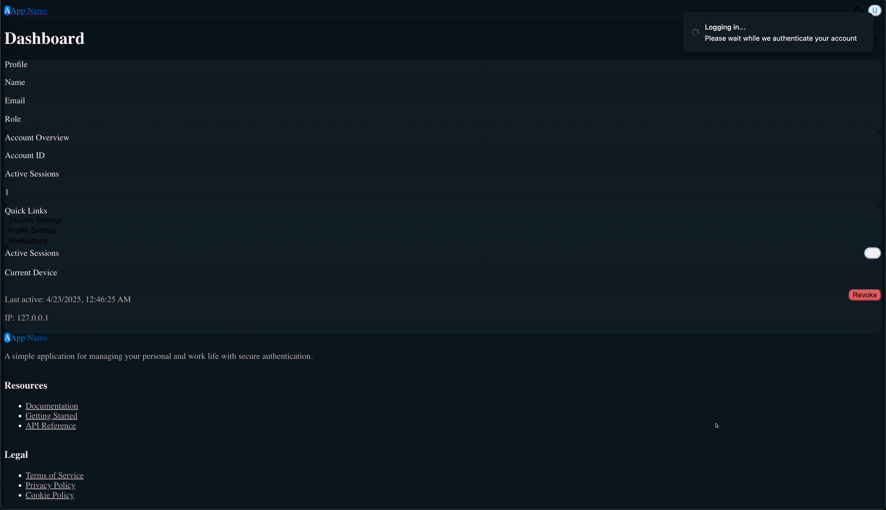

# TypeScript and Python Bootstrap Project

This is a modern web application template with a React TypeScript frontend, FastAPI Python backend, and BetterAuth authentication service. It was mostly created using [Claude Code](https://docs.anthropic.com/en/docs/agents-and-tools/claude-code/overview) agents.

## Features

- React TypeScript frontend with [Vite](https://vite.dev/guide/) tooling and [shadcn](https://ui.shadcn.com/) components
- FastAPI Python backend
- [BetterAuth](www.better-auth.com/docs) authentication service (NodeJS)
  - User creation
  - User login
- Docker Compose for local development
  - Everything is tested in containers just like Prod
  - No need to install NPM or Python locally
- Ready for deployment to Azure through Github Actions
- PostgreSQL database and Redis cache

## Prerequisites

- Docker & Docker Compose
- Azure CLI (for deployment)

## Getting Started

1. Clone this repository
2. For each service folder (FrontEnd, BackEnd, Auth) configure environment variables in `.env` file (copy from `./<service-folder>/.env.example`)
3. Start the application:

```bash
./scripts/stop.sh && ./scripts/start.sh
```

This will start all services in Docker containers:

- Frontend: http://localhost:3000
- Backend API: http://localhost:8000
- Auth Service: http://localhost:4000/api/auth

## Run Tests

```bash
./scripts/test.sh
```

## Check Style & Quality

```bash
./scripts/lint.sh
```

## Deploy

1. Open a PR with the latest changes
2. Merge the PR after all CI checks pass
3. Wait for the automatic CD actions to push images and other necessary changes to Azure


## Demo

Currently the UI is rough. It looks like:


